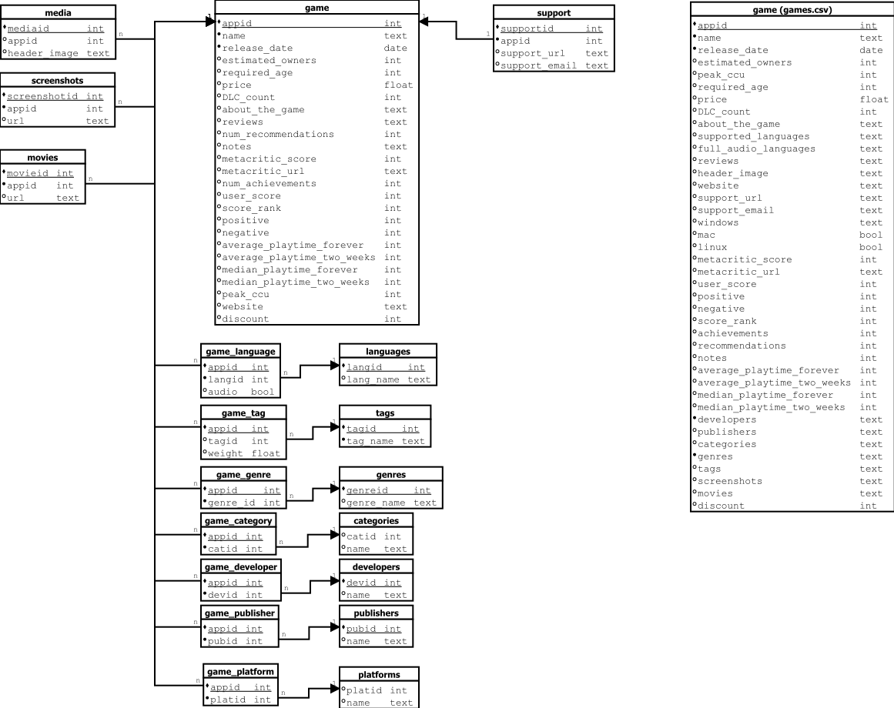

"B" relációs séma normalizálás
==============================

Normalizálás lépései
--------------------

Első normálforma (1NF)
~~~~~~~~~~~~~~~~~~~~~~
- Az eredeti ``game (games.csv)`` tábla tartalmazott ismétlődő és listajellegű mezőket  
  (pl. ``screenshots``, ``tags``, ``categories``, ``genres``, ``supported_languages``, ``full_audio_languages``, ``packages``).  
- Ezeket külön táblákba bontottam:

  * ``media``, ``screenshots``, ``movies`` – a képek és videók atomi sorokban tárolva.  
  * ``categories`` és ``game_category`` – minden kategória külön sorban, kapcsolótáblával.  
  * ``genres`` és ``game_genre`` – minden műfaj külön sorban, kapcsolótáblával.  
  * ``tags`` és ``game_tag`` – címkék külön táblában, kapcsolótáblával.  
  * ``languages`` – a nyelvek külön táblában, egyedi névvel.  
  * ``game_subtitles`` – a játék–nyelv kapcsolat feliratok formájában.  
  * ``game_audio_language`` – a játék–nyelv kapcsolat hang (szinkron) formájában.  
  * ``platforms`` és ``game_platform`` – a játék és platform (Windows, Mac, Linux) kapcsolat normalizált formában.  
  * ``packages`` – a játékcsomagok több szintű szerkezetben tárolva:  

    - ``game_package`` – a játék és csomag kapcsolata (``appid``, ``packid``)  
    - ``packages`` – a csomag alapadatai (``packid``, ``title``, ``description``)  
    - ``sub_package`` – az adott csomag al-elemei (``packid``, ``sub_text``, ``price``)  

Második normálforma (2NF)
~~~~~~~~~~~~~~~~~~~~~~~~~
- A játék tábla elsődleges kulcsa az ``appid``.  
- Az olyan adatok, amelyek nem közvetlenül a játék alapadataihoz tartoznak, külön táblákba kerültek:  

  * ``support`` – támogatási információk (URL, email)  
  * ``media``, ``screenshots``, ``movies`` – multimédiás elemek  
  * ``categories``, ``genres``, ``tags``, ``languages``, ``platforms``, ``developers``, ``publishers``  
  * ``packages`` és ``sub_package`` – a játékhoz tartozó csomagok és al-elemeik  

- A több-több kapcsolatokat asszociatív táblákkal oldottam meg:  

  * ``game_tag (appid, tagid)``  
  * ``game_genre (appid, genreid)``  
  * ``game_subtitles (appid, languageid)``  
  * ``game_audio_language (appid, languageid)``  
  * ``game_developer (appid, devid)``  
  * ``game_publisher (appid, pubid)``  
  * ``game_category (appid, catid)``  
  * ``game_platform (appid, platid)``  
  * ``game_package (appid, packid)``  

Harmadik normálforma (3NF)
~~~~~~~~~~~~~~~~~~~~~~~~~~
- A tranzitív függőségeket megszüntettem:  

  * A ``tags``, ``genres``, ``languages``, ``developers``, ``publishers``, ``categories``, ``platforms``, ``packages`` táblák külön tárolják a megnevezéseket, így nincs redundancia.  
  * A ``languages`` tábla csak a nyelveket tartalmazza (pl. English, Japanese, Hungarian).  
  * A ``game_audio_language`` és ``game_subtitles`` táblák külön kezelik a hang és felirat kapcsolatokat.  
  * Ez megszünteti a ``full_audio_languages`` és ``supported_languages`` közötti redundanciát.  
  * A ``packages`` és ``sub_package`` struktúra lehetővé teszi a csomagok és azok elemeinek részletes, többszintű tárolását.  
  * A platformok (``Windows``, ``Mac``, ``Linux``) normalizálva lettek a ``platforms`` táblába.  

Végső séma – "B" reláció
------------------------
A normalizálás eredményeként a **"B" séma** a következő fő relációkból áll:  

* ``game`` – játék alapadatai (appid, név, dátum, ár, értékelések, playtime, metacritic stb.)  
* ``support`` – támogatási információk  
* ``media`` – fejléckép  
* ``screenshots`` – képernyőképek  
* ``movies`` – előzetesek, videók  
* ``tags`` – címkék  
* ``genres`` – műfajok  
* ``platforms`` – platformok 
* ``categories`` – kategóriák  
* ``publishers`` – kiadók  
* ``developers`` – fejlesztők  
* ``languages`` – nyelvek  
* ``packages`` – játékcsomagok (alapadatok)  
* ``sub_package`` – csomag al-elemei (leírás és ár)  

Kapcsolótáblák:  

* ``game_tag`` – játék–címke kapcsolat  
* ``game_genre`` – játék–műfaj kapcsolat  
* ``game_platform`` – játék–platform kapcsolat  
* ``game_category`` – játék–kategória kapcsolat  
* ``game_publisher`` – játék–kiadó kapcsolat
* ``game_developer`` – játék–fejlesztő kapcsolat  
* ``game_audio_language`` – játék–hangnyelv kapcsolat  
* ``game_subtitles`` – játék–felirat kapcsolat  
* ``game_package`` – játék–csomag kapcsolat  

Összefoglalás
-------------
A **B relációs séma** eredménye egy tiszta, normalizált adatmodell, amely:  

- Atomi értékeket tartalmaz (1NF)  
- Megszünteti a részleges függőségeket (2NF)  
- Kiküszöböli a tranzitív függőségeket (3NF)  
- Külön táblákban kezeli a listaértékű mezőket (pl. nyelvek, kategóriák, címkék, műfajok, platformok, csomagok)  
- A ``supported_languages`` információt a ``game_subtitles`` tábla, míg a ``full_audio_languages`` információt a ``game_audio_language`` tábla tartalmazza.  
- A ``game_package``–``packages``–``sub_package`` struktúra támogatja a több szintű csomagkapcsolatok kezelését.  
- Könnyen bővíthető, karbantartható és minimális adatredundanciát tartalmaz  

Relációs séma diagram
----------------------

Dictionary
----------

Az **"B" adathalmaz dictionary-je** az alábbi linken érhető el:

* `B dataset dictionary <https://github.com/Ddavid111/videogame-data-analysis/blob/main/doc/Dictionaries/B_schema_data_dictionary.xlsx>`_