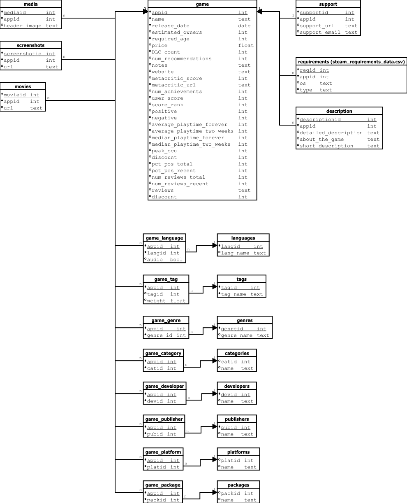

"D" Egységes relációs séma normalizálás
============================================

Bevezetés
---------
A "D" séma a korábbi három (A, B, C) sémák összevonásával és egységesítésével jött létre.  
Kiindulási alapként több, különböző forrásból származó CSV-fájl szolgált, amelyek részben eltérő szerkezetűek voltak, illetve eltérő mezőket tartalmaztak.  

A 2024-es és 2025-ös adatfájlok közötti fő különbség, hogy a 2025-ös verzió tartalmazta a
``discount`` mezőt, míg a 2024-es verzió nem.  
A különböző forrásokból érkező táblák összehangolásával egy egységes, teljes és normalizált adatmodell jött létre.

Normalizálás lépései
--------------------

Első normálforma (1NF)
~~~~~~~~~~~~~~~~~~~~~~
- Az eredeti CSV-fájlok több attribútuma nem atomi értékeket tartalmazott
  (pl. ``tags``, ``genres``, ``categories``, ``supported_languages``, ``full_audio_languages``, ``packages``, ``requirements`` JSON formában).  
- Az 1NF megköveteli, hogy minden attribútum csak atomi értéket vehessen fel.  
- Az ilyen mezők önálló táblákba kerültek, a kapcsolatok pedig asszociatív táblákban vannak tárolva.

  Példák:
  * ``game_subtitles`` + ``languages`` (felirat nyelvek)
  * ``game_audio_language`` + ``languages`` (hang nyelvek)
  * ``requirements`` – rendszerkövetelmények OS és típus (minimum/ajánlott) szerinti bontásban
  * ``game_tag`` + ``tags`` (címkék súlyozással)
  * ``game_genre`` + ``genres``
  * ``game_category`` + ``categories``
  * ``game_platform`` + ``platforms``
  * ``game_package`` + ``packages`` + ``sub_package`` (többszintű csomagszerkezet)

Második normálforma (2NF)
~~~~~~~~~~~~~~~~~~~~~~~~~
- A ``game`` tábla elsődleges kulcsa az ``appid``.
- A nem a játék alapadatait leíró, de az ``appid``-tól függő adatok külön táblákba kerültek:
  
  * ``description`` – részletes, rövid és általános leírások  
  * ``support`` – támogatási információk (URL, email)  
  * ``media`` – fejléckép és háttér  
  * ``screenshots`` – játékhoz tartozó képernyőképek  
  * ``movies`` – videók  
  * ``requirements`` – operációs rendszer és követelménytípus szerinti bontás  
  * ``owners`` – tulajdonosi tartomány szöveges formában  
  * ``languages`` – nyelvek (önálló entitás, amelyet a két asszociatív tábla kapcsol a játékokhoz)  
  * ``packages`` – csomagok alapadatai (``packid``, ``title``, ``description``)  
  * ``sub_package`` – csomag al-elemei (``packid``, ``sub_text``, ``price``)  

Harmadik normálforma (3NF)
~~~~~~~~~~~~~~~~~~~~~~~~~~
- A tranzitív függőségek megszüntetésére az ismétlődő szöveges mezők önálló entitásokba kerültek.  
- A sok-sok kapcsolatokat asszociatív táblák kezelik:

  * ``game_subtitles (appid, languageid)``  
  * ``game_audio_language (appid, languageid)``  
  * ``game_tag (appid, tagid, weight)``  
  * ``game_genre (appid, genreid)``  
  * ``game_category (appid, catid)``  
  * ``game_platform (appid, platid)``  
  * ``game_developer (appid, devid)``  
  * ``game_publisher (appid, pubid)``  
  * ``game_package (appid, packid)``  

- A csomagstruktúra három szinten valósul meg:  
  * ``game_package`` – a játék és csomag kapcsolata (``appid``, ``packid``)  
  * ``packages`` – csomag alapadatai (``packid``, ``title``, ``description``)  
  * ``sub_package`` – a csomag részletei és ára (``packid``, ``sub_text``, ``price``)  

- Ez biztosítja az adatok konzisztenciáját, minimalizálja a redundanciát
  és lehetővé teszi az egyszerű bővíthetőséget.

Végső séma – "D" reláció
--------------------------
A normalizálás eredményeként a **"D" séma** a következő fő relációkból áll:

* ``game`` – játék alapadatai (név, megjelenési dátum, ár, értékelések, játszási idők, metacritic, tulajdonosok, statisztikák, és a 2025-ös verziókban a ``discount`` mező)  
* ``media`` – médiatartalmak  
* ``screenshots`` – képernyőképek  
* ``movies`` – játékhoz tartozó videók  
* ``support`` – támogatási információk  
* ``requirements`` – rendszerkövetelmények  
* ``description`` – leírások  
* ``tags`` – címkék (súlyozással)  
* ``genres`` – műfajok  
* ``platforms`` – platformok  
* ``categories`` – kategóriák  
* ``publishers`` – kiadók  
* ``developers`` – fejlesztők  
* ``languages`` – nyelvek (önálló lista, minden nyelv egyedi sorban)  
* ``packages`` – csomagok alapadatai  
* ``sub_package`` – csomag al-elemei (leírás és ár)  

Kapcsolótáblák:

* ``game_tag`` – játék–címke kapcsolat  
* ``game_genre`` – játék–műfaj kapcsolat  
* ``game_platform`` – játék–platform kapcsolat  
* ``game_category`` – játék–kategória kapcsolat
* ``game_publisher`` – játék–kiadó kapcsolat  
* ``game_developer`` – játék–fejlesztő kapcsolat 
* ``game_audio_language`` – játék–hangnyelv kapcsolat    
* ``game_subtitles`` – játék–felirat kapcsolat  
* ``game_package`` – játék–csomag kapcsolat  

Összefoglalás
-------------
A **D relációs séma** az előző A, B és C sémák összevonásából született meg.  
Fő előnyei:

- Egységesítette a különböző CSV-forrásokból származó adatokat  
- Biztosítja az 1NF, 2NF és 3NF követelményeit  
- Megszüntette a redundáns és nem atomi mezőket  
- Külön kezeli a feliratokat (``game_subtitles``) és a hangnyelveket (``game_audio_language``)  
- A csomagokat háromszintű struktúrában kezeli (``game_package`` → ``packages`` → ``sub_package``)  
- Kezeli a sok-sok kapcsolatokat asszociatív táblákon keresztül  
- Tartalmaz minden fontos információt a játékokról, bővíthető módon  
- Megkülönbözteti a források közti eltéréseket (pl. ``discount`` csak a 2025-ös adatokban szerepelt)  
- Az adatok konzisztens, redundanciamentes és bővíthető adatmodellbe szerveződnek  

Relációs séma diagram
----------------------

Dictionary
----------

Az **"D" adathalmaz dictionary-je** az alábbi linken érhető el:

* `D dataset dictionary <https://github.com/Ddavid111/videogame-data-analysis/blob/main/doc/Dictionaries/D_schema_data_dictionary.xlsx>`_
