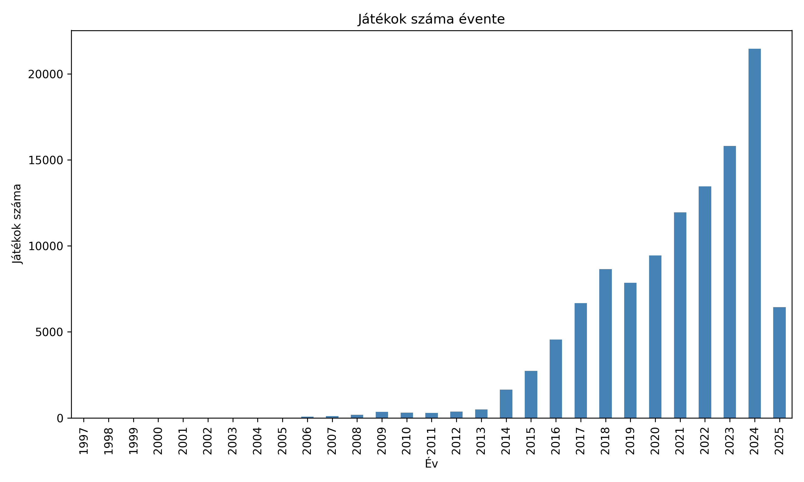
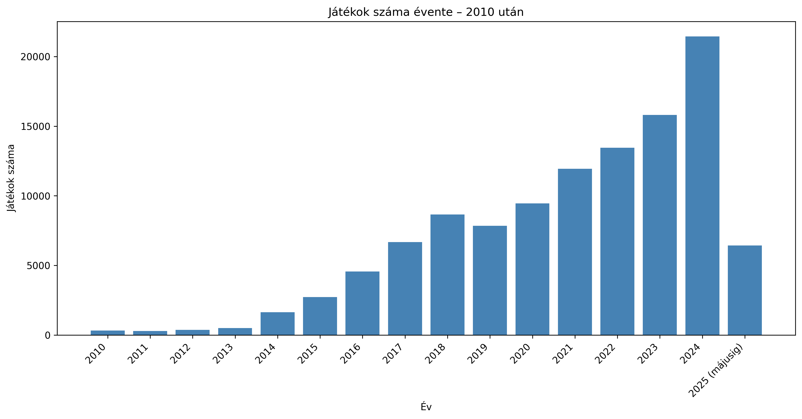
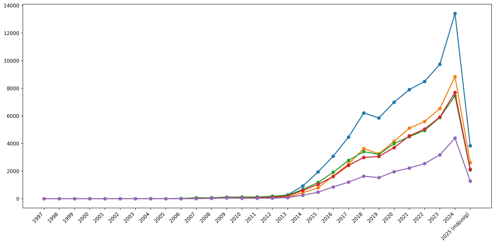
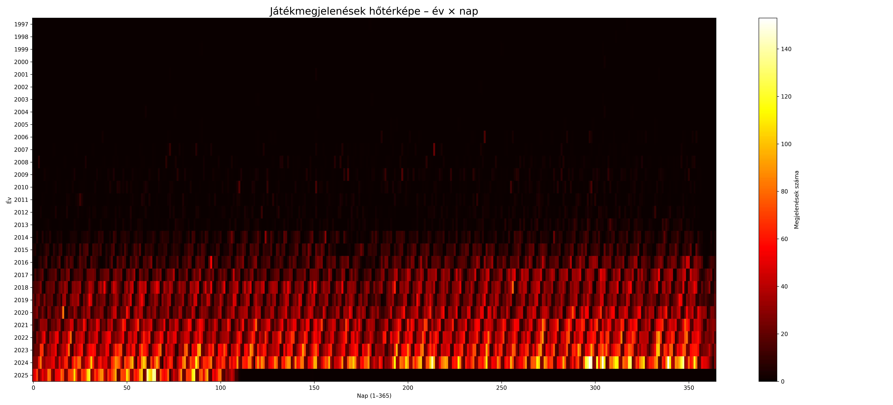
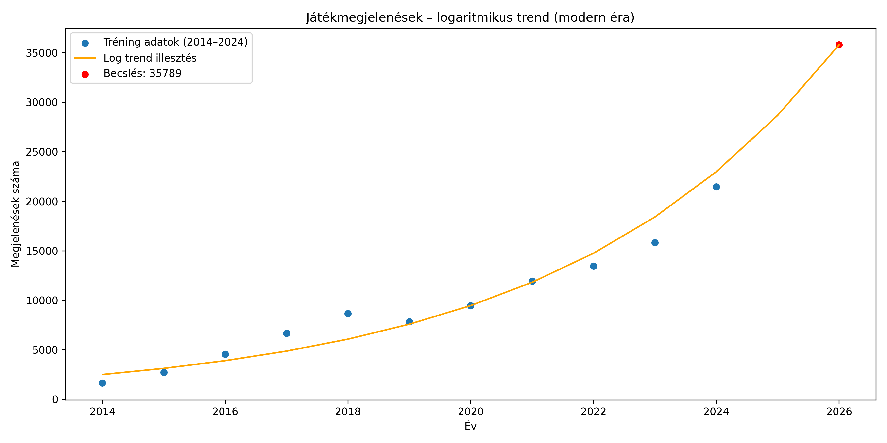
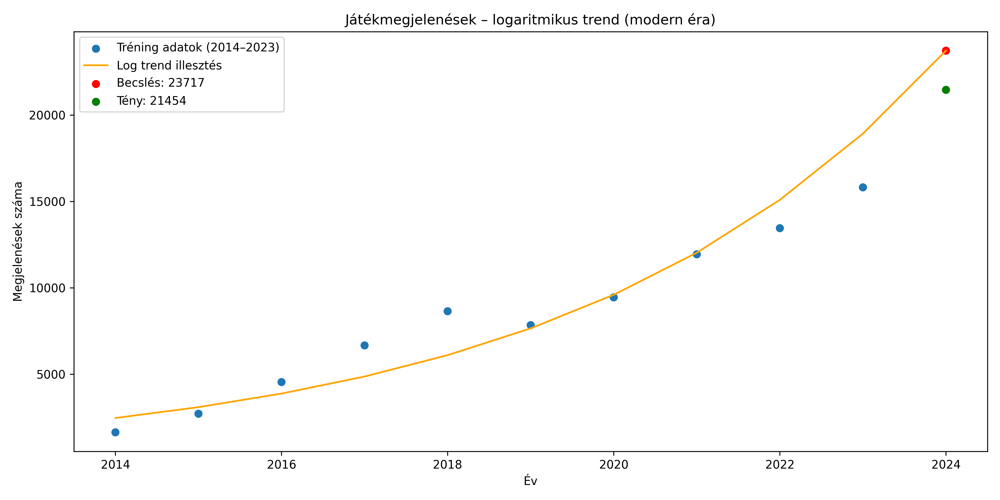

===========================================
Hisztogramok és trendvizualizációk
===========================================

Ez a fejezet a videojáték-megjelenések időbeli dinamikáját mutatja be.
Az ábrák a Steam teljes adatbázisából generált statisztikákra épülnek
(1997–2025 májusáig).

Az elemzésben megjelennek:

- éves megjelenésszámok (összesített, érák szerint)
- forráskategóriák szerinti bontások (**A / B / C**)
- műfaji trendek (Top 5)
- növekedési faktorok (log skálán)
- szezonális mintázatok (havi / heti / napi felbontásban)
- év × nap hőtérkép
- logaritmikus trendbecslés és 2026 előrejelzés

Az ábrák minden esetben a következő könyvtárban találhatók:

`merge/output <https://github.com/Ddavid111/videogame-data-analysis/blob/main/merge/output>`_

Összes játék megjelenése évente
-------------------------------------------

Az ábra jól mutatja a 2014 utáni extrém gyors növekedést,
melyet a Steam Direct modell és az indie fejlesztők tömeges megjelenése okozott.
2024-ben érte el a csúcsot, 21 000 feletti megjelenésszámmal.

Játékmegjelenések 2010 előtt
-------------------------------------------

.. image:: ../../merge/output/hist_pre2010.png
   :align: center
   :alt: Megjelenések 2010 előtt
   :class: merge-diagram

A 2010 előtti időszakban még nagyságrendekkel kevesebb cím érkezett:
a kiadói modell dominált, indie fejlesztők alig voltak jelen.

Játékmegjelenések 2010 után
-------------------------------------------

A 2014-es váltás után ugrásszerű növekedés indult,
és a 2020–2024 közötti években stabilan 10–20 ezer közötti cím érkezett évente.

Forrás szerinti bontás (**A, B, C kategória**)
-----------------------------------------------

A kategóriák:

- **A dataset**
- **B dataset**
- **C dataset**

A három kategória külön grafikonon is megjelenik.

**A kategória:**

.. image:: ../../merge/output/hist_sources_A.png
   :align: center
   :alt: A kategória évenkénti megjelenései
   :class: merge-diagram

**B kategória:**

.. image:: ../../merge/output/hist_sources_B.png
   :align: center
   :alt: B kategória évenkénti megjelenései
   :class: merge-diagram

**C kategória:**

.. image:: ../../merge/output/hist_sources_C.png
   :align: center
   :alt: C kategória évenkénti megjelenései
   :class: merge-diagram

A **B** és **C** kategória növekedése sokkal szignifikánsabb, mint az **A** kategóriáé.
2025-ben már májusig 2300+ **B** kategóriás megjelenés történt.

Top 5 műfaj időbeli trendje
-------------------------------------------

A legnépszerűbb műfajok:

- Indie
- Casual
- Action
- Adventure
- Simulation

Az Indie műfaj toronymagasan vezet, és a modern időszakban (2014 után)
jó közelítéssel a teljes PC-s játékkínálat bővülésének indikátoraként
értelmezhető.

A műfajok idősorai között rendkívül erős együttmozgás figyelhető meg:
a 2014–2024 közötti időszakban számított Pearson-korrelációs együtthatók
minden műfajpár esetén 0,99 felettiek, míg a Spearman-féle rangkorrelációk
szinte tökéletes monotón kapcsolatot jeleznek. Ez arra utal, hogy a
különböző műfajok növekedése nem egymás rovására történik, hanem egy
közös mögöttes piaci expanziót követ.

A volumenek aránya hosszabb távon stabilnak mutatkozik: a Casual,
Action és Adventure műfajok megjelenésszáma nagyságrendileg az Indie
megjelenések 50–70%-a között alakul, míg a Simulation műfaj részesedése
ennek körülbelül a fele. Ennek megfelelően a műfajok idősorai nem
tekinthetők függetlennek, és a teljes kínálat növekedése jól közelíthető
egy központi volumenindikátor (Indie) és közel konstans műfajarányok
segítségével.

Műfajok közötti korrelációk (2014–2024)
^^^^^^^^^^^^^^^^^^^^^^^^^^^^^^^^^^^^^^^

A Top 5 műfaj idősorai közötti együttmozgást kvantitatív módon is
ellenőriztük. Az alábbi táblázatok a Pearson-féle lineáris korrelációt,
illetve a Spearman-féle rangkorrelációt mutatják a teljes, 2014–2024
közötti időszakra számítva.

Pearson-korreláció:

+-------------+---------+------------+---------+-------+-------------+
|             | Action  | Adventure  | Casual  | Indie | Simulation  |
+=============+=========+============+=========+=======+=============+
| Action      | 1.000   | 0.997      | 0.998   | 0.997 | 0.994       |
+-------------+---------+------------+---------+-------+-------------+
| Adventure   | 0.997   | 1.000      | 0.998   | 0.994 | 0.996       |
+-------------+---------+------------+---------+-------+-------------+
| Casual      | 0.998   | 0.998      | 1.000   | 0.997 | 0.996       |
+-------------+---------+------------+---------+-------+-------------+
| Indie       | 0.997   | 0.994      | 0.997   | 1.000 | 0.992       |
+-------------+---------+------------+---------+-------+-------------+
| Simulation  | 0.994   | 0.996      | 0.996   | 0.992 | 1.000       |
+-------------+---------+------------+---------+-------+-------------+

Spearman-korreláció:

+-------------+---------+------------+---------+-------+-------------+
|             | Action  | Adventure  | Casual  | Indie | Simulation  |
+=============+=========+============+=========+=======+=============+
| Action      | 1.000   | 0.991      | 1.000   | 1.000 | 1.000       |
+-------------+---------+------------+---------+-------+-------------+
| Adventure   | 0.991   | 1.000      | 0.991   | 0.991 | 0.991       |
+-------------+---------+------------+---------+-------+-------------+
| Casual      | 1.000   | 0.991      | 1.000   | 1.000 | 1.000       |
+-------------+---------+------------+---------+-------+-------------+
| Indie       | 1.000   | 0.991      | 1.000   | 1.000 | 1.000       |
+-------------+---------+------------+---------+-------+-------------+
| Simulation  | 1.000   | 0.991      | 1.000   | 1.000 | 1.000       |
+-------------+---------+------------+---------+-------+-------------+

A kétféle korrelációs mérőszám egybehangzóan rendkívül erős
együttmozgást jelez, ami alátámasztja, hogy a vizsgált műfajok
idősorai nem tekinthetők egymástól függetlennek.

Éves növekedési faktor (log-skála)
-------------------------------------------

.. image:: ../../merge/output/hist_growth_rates.png
   :align: center
   :alt: Éves növekedési faktor
   :class: merge-diagram

A logaritmikus skála jól mutatja a kiugró éveket (2005, 2014),
illetve a stagnáló vagy visszaeső periódusokat.

Év × nap hőtérkép
-------------------------------------------

A hőtérkép látványosan mutatja a publikálási intenzitás hosszú távú
növekedését és a szezonalitás jelenlétét. A 2014 utáni időszakban a
megjelenések sűrűsége folyamatosan emelkedik, 2023–2025 között pedig
már szinte minden napra jut több tucat új játék.

A mintázat alapján a publikálás nem egyenletes: bizonyos időszakokban
és napokon koncentráltabb aktivitás figyelhető meg. Mivel azonban az
év napjainak hétköznapra esése évről évre eltér, a hét napjaihoz
kapcsolódó hatások ebben a nézetben részben elkenődnek.

Év × (ISO hét × hét napja) hőtérkép
-----------------------------------

.. image:: ../../merge/output/heatmap_year_weekday_aligned.png
   :align: center
   :alt: Év × ISO hét × hét napja hőtérkép
   :class: merge-diagram

A napokat ISO hét és hét napja szerint egymásra igazítva a publikálási
mintázat letisztultabban értelmezhető. Ebben a nézetben a hét napjai
szerint is kimutatható periodicitás jelenik meg, valamint a szezonális
különbségek következetesebben rajzolódnak ki.

A modern időszakban a megjelenések számának növekedése nem
kampányszerű, hanem folyamatos, ami strukturális piaci bővülésre utal.

Szezonális mintázatok – havi, heti, napi
-------------------------------------------

A játékmegjelenések időbeli szerkezetét több idősíkban vizsgáltuk,
mivel az eltérő felbontások más-más jellegű mintázatokat emelnek ki.

**Havi overlay:**

.. image:: ../../merge/output/seasonal_monthly_overlay.png
   :align: center
   :alt: Havi szezonális mintázatok
   :class: merge-diagram

A havi bontás jól mutatja a hosszabb távú szezonalitást és az évről évre
fokozódó volumen növekedést. A modern időszakban a megjelenések száma
szinte minden hónapban emelkedő trendet követ, jelentősebb visszaesések nélkül.

**Heti overlay:**

.. image:: ../../merge/output/seasonal_weekly_overlay.png
   :align: center
   :alt: Heti szezonális mintázatok
   :class: merge-diagram

A heti aggregálás csökkenti a napi fluktuációt, miközben megőrzi
az éven belüli ciklikus mintázatokat. Az egyes évek görbéi erősen együtt mozognak,
ami arra utal, hogy a publikálási dinamika időben stabil szerkezetet követ.

**Napi (ISO-heti igazított) overlay:**

.. image:: ../../merge/output/seasonal_weekly_overlay_iso.png
   :align: center
   :alt: Heti bontás – weekday-hatás csökkentése
   :class: merge-diagram

A napi szintű adatok önmagukban rendkívül zajosak,
elsősorban a hét napjának hatása miatt.
Ezért a napi megjelenéseket ISO-heti bontásban aggregáltuk,
amellyel a weekday-hatás jelentős része kiküszöbölhető.

Az így kapott idősorok már jól összevethetők egymással:
a csúcsok és visszaesések időben nagyrészt egybeesnek,
ami erős együttmozgásra és ismétlődő publikálási mintázatokra utal.
A 2020 utáni időszakban szinte minden héten tartósan magas
megjelenésszám figyelhető meg.

2026 előrejelzés (log-lineáris trend alapján)
---------------------------------------------

A modern évek (2014–2024) adataira illesztett log-lineáris
(exponenciális) trend alapján a 2026-os évre
**~35 789 új játékmegjelenés** adódik.

A modell 2024-re visszatesztelve kb. **10%-os túlbecslést**
mutatott, ezért a 2026-os érték **optimista forgatókönyvként**
értelmezendő, és inkább felső becslésnek tekinthető.
A növekedés üteme a piac telítődése vagy platformszabályozás
miatt a következő években mérséklődhet.

Modellvalidáció – 2024 visszateszt
----------------------------------

A modell teljesítményének ellenőrzésére a 2014–2023 közötti
adatokon tanított log-lineáris trenddel előrejeleztük a 2024-es
évet. A becslés **23 717** megjelenést adott, míg a tényleges
érték **21 454** volt, ami kb. **10%-os eltérést** jelent.

Ez az eredmény arra utal, hogy a modell a közelmúltban enyhén
optimista, ugyanakkor a növekedési trend irányát és nagyságrendjét
helyesen ragadja meg, így extrapolációs alapként használható.

