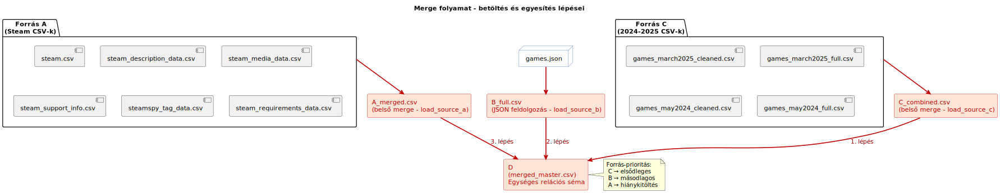

Merge Process
=============

*A fenti ábra PlantUML forráskódja külön fájlban is elérhető:*  
`merge_process.puml <https://github.com/Ddavid111/videogame-data-analysis/blob/main/merge/merge.puml>`_

Lépések
--------

A fenti ábra a teljes összefésülési (merging) folyamatot mutatja be,
amely során az **A**, **B** és **C** forrásadatokból egy egységesített
**D adatmodell** jön létre.

A merge három fő lépésből áll:

1. **Forrás C feldolgozása** → `C_combined.csv`

   A 2024–2025-ös CSV-fájlok összevonása és előtisztítása.

2. **Forrás B feldolgozása** → `B_full.csv`  

   A JSON formátumú SteamSpy adatok normalizálása és táblásítása.

3. **Forrás A feldolgozása** → `A_merged.csv`  

   A több CSV-ből álló Steam-metaadatok belső összevonása.

Ezt követően a három rész-adathalmaz **prioritás alapján** kerül egyesítésre:

- **C = elsődleges forrás**  
- **B = másodlagos forrás**  
- **A = kitöltő/harmadlagos forrás**

Az eredmény egy egységes relációs struktúra (`merged_master.csv`), amely már
alkalmas a normalizálásra és az SQL alapú adatbázis felépítésére.
